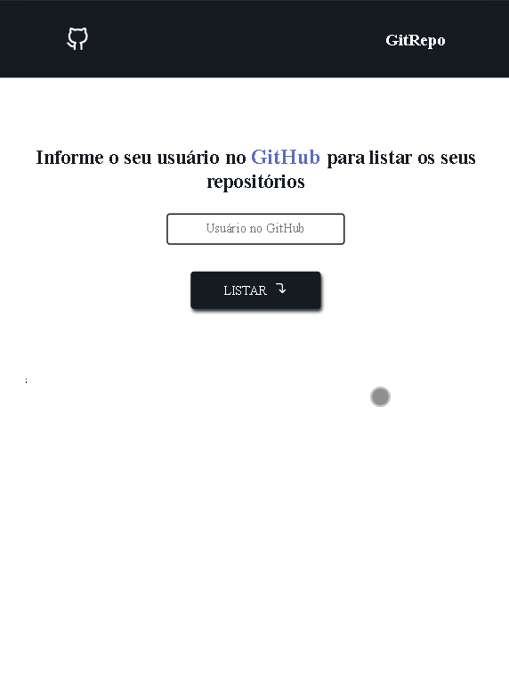

<h1 align="center">
  
</h1>

<h2 align="center">Front end application 📟 👨‍💻</h2>

## <h3 align="center">Application that lists GitHub users repositories, using the [GitHub API](https://docs.github.com/en/rest/reference/repos) being possible to favorite them</h3>

# **Web Layout** 💻

  

# **Tablet Layout** 💻

  

## :star: Features
- [x] Listing a Github user's public repositories
- [x] Favorite a repository

## 🚀 Tecnologias utilizadas:

## 💻 Aplicação na Web:
<h3 align="left">[Web application](https://git-repomathwcruz.netlify.app/)</h3>

Starting the walk to be able to participate in the marathon in this programming world 🏃‍

### Author
---

<a href="https://app.rocketseat.com.br/me/matheus-da-cruz-frontend">
 
  
 <b>Matheus da Cruz</b></a> <a href="https://app.rocketseat.com.br/me/matheus-da-cruz-frontend" title="Rocketseat">  🚀</a>

 

